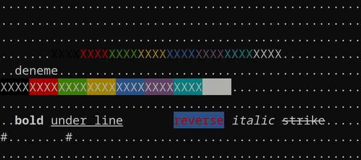

# teriminal


teriminal is a header only terminal text style and position library.


**Table of contents**:
+ [Usage](#usage)
  + [Example Usage](#example-usage)
  + [Colors](#colors)
  + [Text Decorations](#text-decorations)
+ [Contributing](#contributing)
+ [License](#license)

## Usage
### Example usage

```c
#include "teriminal.h"

int main(){
    teriminal_clear();
    for(int i=0;i<10;i++){
        for(int j=0;j<50;j++)
            printf(".");
        printf("\n");

    }

    teriminal_goto_abs(3, 5); // absolute position
    printf("deneme");
    teriminal_goto_rel(0, -1); // relative position
    teriminal_set_color(BLACK);printf("XXXX");
    teriminal_set_color(RED);printf("XXXX");
    teriminal_set_color(GREEN);printf("XXXX");

    teriminal_goto_x_rel(-50);
    teriminal_goto_y_rel(2);

    teriminal_set_color(BG_RED);printf("XXXX");
    teriminal_set_color(BG_GREEN);printf("XXXX");
    teriminal_text_decoration(DEFAULT);

    teriminal_text_decoration(BOLD);
    printf("bold");
    teriminal_text_decoration(DEFAULT);

    teriminal_goto_abs(10, 9);
    teriminal_cursor_save(); // Save current corsor position
    teriminal_goto_abs(0, 9);
    printf("#");
    teriminal_cursor_load(); // Go back saved position
    printf("#");
    teriminal_goto_abs(0, 11);
    return 0;
}
```

### Colors
```c
// Text colors
BLACK,
RED,
GREEN,
YELLOW,
BLUE,
PURPLE,
CYAN,
WHITE,

// Background colors
BG_BLACK,
BG_RED,
BG_GREEN,
BG_YELLOW,
BG_BLUE,
BG_PURPLE,
BG_CYAN,
BG_WHITE,
```

### Text Decorations
```c
DEFAULT,
BOLD,
BLINK,
UNDER_LINE,
REVERSE_COLORS,

// Not supported on all terminals
ITALIC,
FAST_BLINK,
STRIKE,
DUBLE_BOLD,
DUBLE_UNDER_LINE,
```

## Contributing
This project accepts the open source and free software mentality in its main terms.
Development and distribution are free within the framework of the rules specified 
in the license section, BUT the course and mentality of the project depends entirely
on my discretion. Please respect this mentality and contributing rules.

See all rules [CONTRIBUTING.md](./CONTRIBUTING.md)

## License
This project is under the [GPLv3 license](./LICENSE).
